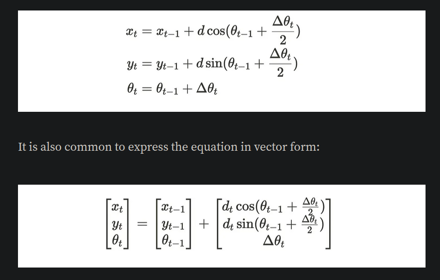
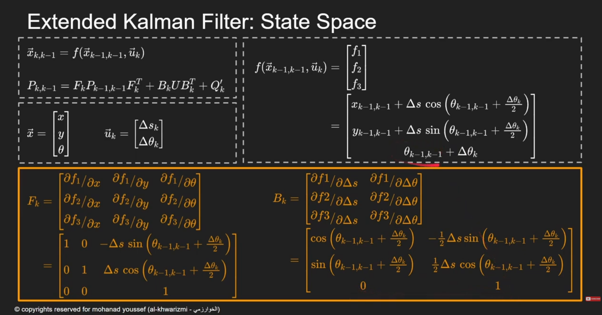
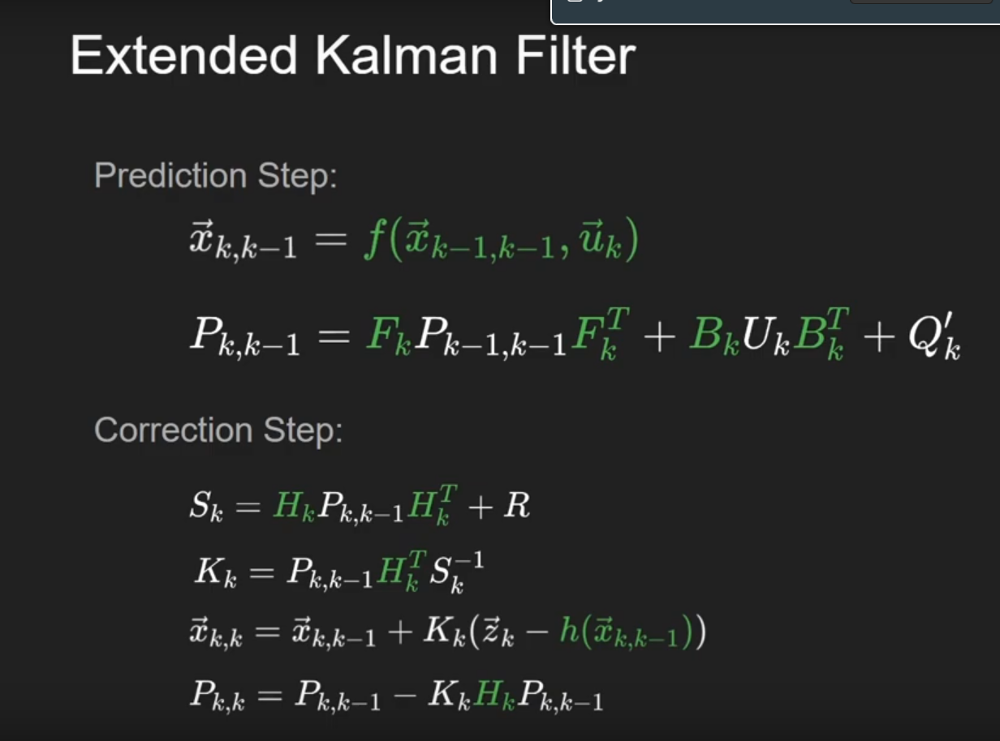
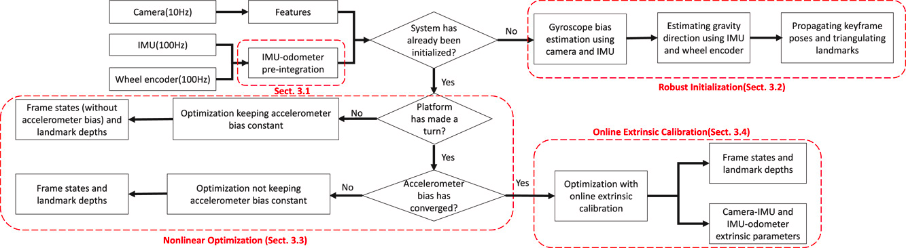

# ESP32-localization:
### This projects aims to achieve the localization and mapping of an autonomous Rover or ROV.

## Localization options: 
Both options should output a set of data representing the _position_ and _orientation_ 
in 3d space, _angular_ and _linear_ velocities.
    
- **Odometery:** 
     primary uses wheel encoders combined with IMU data. Used on ground vehicles as dead reckoning is prone to errors from acceleration sensors.
linear errors occur as a result of uneven or slippery surfaces. Filters and sensor fusion can be applied. 
  - [Basics](https://www.youtube.com/watch?v=LrsTBWf6Wsc&t=498s)
  - [More accurate derivation and equations](https://medium.com/@nahmed3536/wheel-odometry-model-for-differential-drive-robotics-91b85a012299)
  

- **Dead reckoning:** relies on sensors that output acceleration, velocity, and direction. Integration drift error accumulates over time. Used in situation where encoders 
are impractical as water and air vehicles. Dead reckoning is the go as
the wheel velocities are sent when a request is made from the esp.

### BNO08x:
the BNO08x has on board sensor 32-bit arm cortex processor that runs 
sensor fusion algorithm to output real time, around 400hz. 
The sensor can output rotation vector, quaternion, gyro, accelerometer,
and magnetometer data.
Due to the limited numbers of pins, BNO will communicate using I2C
Sparkfun library can support multiple sensors.

### Equations for linear Kalman filter:
$$
P_{k∣k−1}​=P_{k−1∣k−1}​+Q
$$

- $P_{k∣k−1​}$: predicted estimate covariance (error estimate) at time kk.
- $P_{k−1∣k−1}$: the updated error estimate from the previous step.
- $Q$: process variance.
  The Kalman gain determines how much the new measurement should adjust the estimate. It balances the trust between the prediction and the measurement.

$$
K_k = \frac{P_{K|k-1}}{P_{K|k-1}+R}
$$

- $R$: measurement variance.

$$
X_{k|k} = X_{k|k-1} + K_k * (Z_k - X_{k|k-1})
$$

- $X_{k|k}$: The updated state estimate after incorporating the new measurement.
- $X_{k|k-1}$: The predicted state estimate.
- $Z_k$: The new measurement.
- $K_k$: The Kalman gain.

Updating the error estimate:

$$
P_{k∣k​}=(1−K_k​)P_{k∣k−1}
$$

### Sensor fusion and filtering:
- **kalman filter:** is the best option for linear systems. However, the change in velocity is not linear,
nor the encoder's data with respect to the accelerometer.
- **Extended Kalman filter:** can be considered as another version of the linear
kalman filter, but can handle non-linear systems. It is supported by the ESP-IDF DSP
library, it is optimized to be efficient.
- **Unscented kalman filter:** can handle the cases where the non-linearity 
increases. However, it is computationally expensive. However, it is the way 

### Extended kalman filter:
Everything is similar with the Linear Kalman filter, however, this uses 
Taylor polinomials to normalize non-linear systems.

*This is the model and prediction step*

*Correction Steps*

### Problems to be addressed:
- regular kalman filter can be applied to yaw angle for regular IMUs. However, as I stated above, BNO does everything for us.
- slipping while rotating: can be corrected by fusing imu with odometry
- bumps and irregularities: add the acceleration to the kalman filter should
decrease the problem, if not, orientation can be added.
- the acceleration on the z-axis can ruin the localization system, some of it will leak 
    into other acceleration vectors.
- taring is essential, as it tells the BNO the inetial position.
  
### Testing steps:
_Each step adds a layer to the preceding one_
- [ ] __Step 0:__ Test IMU, calibration, taring, frequency 
- [ ] __Step 1:__ Test Odometry without the IMU 
  - [ ] __Step 1.1:__ Apply kalman filter to the Odometry
  - [ ] __Step 1.2:__ Use Odometry for linear movements, IMU for angles
  - [ ] __Step 1.3__ Add IMU to the odometry Model
- [ ] __Step 2:__ Test Dead Reckoning without the IMU 
  - [ ] __Step 2.1:__ Apply kalman filter for dead reckoning
  - [ ] __Step 2.2:__ Use Dead Reckoning for linear movements, IMU for angles 
  - [ ] __Step 2.3:__ Fuse Odometry with IMU 
  - [ ] __Step 2.5:__ Add IMU to dead reckoning model
- [ ] __Step 3:__ Merge accelerometer with the readings 
- [ ] __step 4:__ Add gps to the party.

### TO DO: (Prioritized)
- [x]  __Finish odom__ 
- [x] __Finish deadReckoning__
- [x] __BNO085 Setup__
- [x] __Research Sensor Fusion__
- [ ] __implement sensor fusion__
- [ ] __Mapping techniques__
- [ ] __anti-slipping mechanism__
- [ ] __Optimize task handling__

We are following a similar approach - excluding the camera - to the image above, the direction and calibration of the IMU are done automatically on the BNO board. Taring is done at the begining of the 
run, that is, reset the imu directions to the current state. Calibration of the wheels and motors shall be easier and straight forward, but it is crucial for straight driving and accurate measurements.

### Important ressources: 
[This repo](https://github.com/xiaozhengxu/CompRobo_IMU_Sensor_fusion?tab=readme-ov-file), and its [explaination](https://xiaozhengxu.github.io/CompRobo_IMU_Sensor_fusion/), provide a very close explaination of what we are trying to achieve, however, they do not account for bumps or irregularities in the track.

From the above resources, the part we
    

### Resources:
- [Unscented Kalman Filter for 6DoF IMU](https://github.com/JChunX/ukf)
- [Extended Kalman Filter for position & orientation tracking on ESP32 ](https://github.com/JChunX/imu-kalman)
- [MPU driver](https://github.com/natanaeljr/esp32-MPU-driver)
- [Gaussian filter](https://www.youtube.com/watch?v=oPgfa6G2AxE)
- [Unscented Kalman Filter(video)](https://www.youtube.com/watch?v=c_6WDC66aVk)
- [EKF esp32 example from espressif](https://docs.espressif.com/projects/esp-dsp/en/latest/esp32/esp-dsp-examples.html)
- [Filters + particle filter](https://github.com/baggepinnen/LowLevelParticleFilters.jl)
- [Open KF](https://github.com/Al-khwarizmi-780/OpenKF)
- [Encoders and IMU sensor Fusion](https://medium.com/hackernoon/ghost-iv-sensor-fusion-encoders-imu-c099dd40a7b)
- [How to fuse sensors stack exchange](https://robotics.stackexchange.com/questions/22115/how-to-actually-fuse-sensor-using-extended-kalman-filter)
- [Quaternions-part 1](https://www.youtube.com/watch?v=d4EgbgTm0Bg)
- [Quaternions-part 2]()
- [BNO085 library](https://github.com/sparkfun/SparkFun_BNO080_Arduino_Library?tab=readme-ov-file)
- [Visualizing Quaternions](https://eater.net/quaternions/video/stereo4d)
- [Ros robot localization package](9https://eater.net/quaternions/video/stereo4d), the package itself is not docuemnted, not recommended overall
- [Sensor fusion full course](https://www.youtube.com/watch?v=FGaOxS3-8gU&list=PLluhvIZgE0mP3Cm36ua4i98A-G43Lw_KU&index=23)
