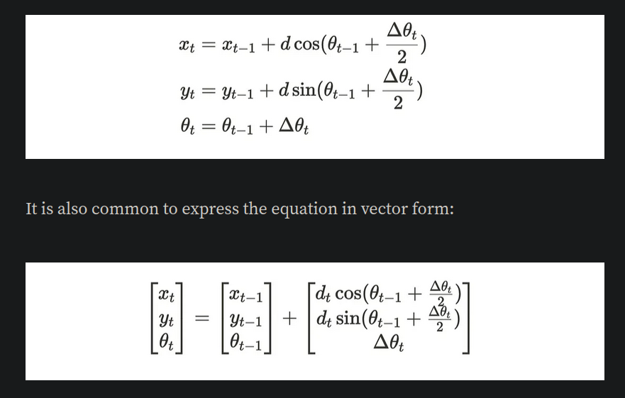
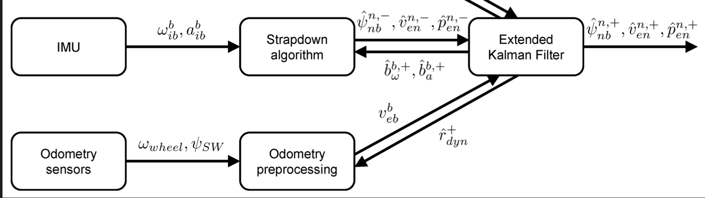

# ESP32-localization:
### This projects aims to achieve the localization and mapping of an autonomous Rover or ROV.

## Localization options: 
Both options should output a set of data representing the _position_ and _orientation_ 
in 3d space, _angular_ and _linear_ velocities.
    
- **Odometery:** 
     primary uses wheel encoders combined with IMU data. Used on ground vehicles as dead reckoning is prone to errors from acceleration sensors.
linear errors occur as a result of uneven or slippery surfaces. Filters and sensor fusion can be applied. 
  - [Basics](https://www.youtube.com/watch?v=LrsTBWf6Wsc&t=498s)
  - [More accurate derivation and equations](https://medium.com/@nahmed3536/wheel-odometry-model-for-differential-drive-robotics-91b85a012299)
  

- **Dead reckoning:** relies on sensors that output acceleration, velocity, and direction. Integration drift error accumulates over time. Used in situation where encoders 
are impractical as water and air vehicles. Dead reckoning is the go as
the wheel velocities are sent when a request is made from the esp.

### BNO08x:
the BNO08x has on board sensor 32-bit arm cortex processor that runs 
sensor fusion algorithm to output real time, around 400hz. 
The sensor can output rotation vector, quaternion, gyro, accelerometer,
and magnetometer data.
Due to the limited numbers of pins, BNO will communicate using I2C

### Sensor fusion and filtering:
- **kalman filter:** is the best option for linear systems. However, the change in velocity is not linear,
nor the encoder's data with respect to the accelerometer.
- **Extended Kalman filter:** can be considered as another version of the linear
kalman filter, but can handle non-linear systems. It is supported by the ESP-IDF DSP
library, it is optimized to be efficient.
- **Unscented kalman filter:** can handle the cases where the non-linearity 
increases. However, it is computationally expensive. However, it is the way 

### Then how does it all work:
1. User should specify which method to use (Odometer, dead reckoning)
2. a pose 3d is calulated from the wheel and from the rotation vector
of the IMU
3. data are fused together using EKF
4. EKF is calibrated

### TO DO: (Prioritized)
- [x]  __Finish odom__ 
- [x] __Finish deadReckoning__
- [x] __BNO085 Setup__
- [x] __Research Sensor Fusion__
- [ ] __implement sensor fusion__
- [ ] __Mapping techniques__
- [ ] __anti-slipping mechanism__
- [ ] __Optimize task handling__

### Resources:
- [Unscented Kalman Filter for 6DoF IMU](https://github.com/JChunX/ukf)
- [Extended Kalman Filter for position & orientation tracking on ESP32 ](https://github.com/JChunX/imu-kalman)
- [MPU driver](https://github.com/natanaeljr/esp32-MPU-driver)
- [Gaussian filter](https://www.youtube.com/watch?v=oPgfa6G2AxE)
- [Unscented Kalman Filter(video)](https://www.youtube.com/watch?v=c_6WDC66aVk)
- [EKF esp32 example from espressif](https://docs.espressif.com/projects/esp-dsp/en/latest/esp32/esp-dsp-examples.html)
- [Filters + particle filter](https://github.com/baggepinnen/LowLevelParticleFilters.jl)
- [Open KF](https://github.com/Al-khwarizmi-780/OpenKF)
- [Encoders and IMU sensor Fusion](https://medium.com/hackernoon/ghost-iv-sensor-fusion-encoders-imu-c099dd40a7b)
- [How to fuse sensors stack exchange](https://robotics.stackexchange.com/questions/22115/how-to-actually-fuse-sensor-using-extended-kalman-filter)
- [Quaternions-part 1](https://www.youtube.com/watch?v=d4EgbgTm0Bg)
- [Quaternions-part 2]()
- [BNO085 library](https://github.com/sparkfun/SparkFun_BNO080_Arduino_Library?tab=readme-ov-file)
- [Visualizing Quaternions](https://eater.net/quaternions/video/stereo4d)
- [Ros robot localization package](9https://eater.net/quaternions/video/stereo4d)
- [Sensor fusion full course](https://www.youtube.com/watch?v=FGaOxS3-8gU&list=PLluhvIZgE0mP3Cm36ua4i98A-G43Lw_KU&index=23)